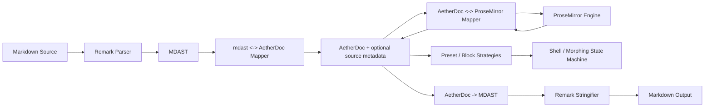

# 架构优化原则与设计模式

> 状态：设计护栏 · 2026-07  
> 适用范围：桥接层、Adapter、Preset、React Shell / Morphing surface、Markdown 往返链路  
> 非目标：本文不改变运行时代码、公开 API、OpenSpec 主规格或 ADR 结论。

## 目的

本文总结 AetherMD 当前桥接层架构的优化方向，并为后续实现提供可执行的设计原则。它不是通用设计模式清单，而是用于回答以下问题：

- Markdown 语法规则应该归谁维护？
- `AetherDoc` 这层是否必要？
- Remark、ProseMirror、Preset、React Shell 的边界如何避免互相污染？
- Instant Morphing 需要怎样的 block-level 架构支撑？
- 后续新增抽象时，怎样判断它是必要边界还是过度设计？

结论先行：**AetherDoc + Adapter 隔离这条主架构应保留；需要优化的是语法所有权、序列化链路、morphing source/render 策略和设计护栏。**

## 当前判断

AetherMD 当前桥接层不是因为“重复解析”才存在，而是为了隔离第三方模型：

- Remark 负责 Markdown 到 MDAST 的解析。
- ProseMirror 负责编辑事务和编辑状态。
- `AetherDoc` 是 Core、SDK、Preset、Shell 之间共享的框架无关语义模型。
- Adapter 是 Remark / ProseMirror 私有类型进入 AetherMD 的防腐边界。

这与 [ADR 003：Remark 与 ProseMirror 双轨分离](../adr/003-remark-prosemirror-dual-track.md) 一致。

真正需要优化的是：当前少量 Markdown 输出和渲染规则已经散落在多个位置。MVP 阶段可以接受，但如果继续扩展到 table、task list、nested list、自定义块或 source-preserving morphing，就会形成多套语法事实源。

## 目标架构



这条链路表达四个边界：

1. Markdown 解析和字符串化应尽量交给 Remark / MDAST 生态。
2. AetherMD 维护的是 `MDAST <-> AetherDoc`、`AetherDoc <-> ProseMirror` 的映射，不维护完整 Markdown parser。
3. Preset / 块插件拥有 syntax-specific source/render 策略。
4. Shell 只负责编排交互状态，不内嵌 GFM 语法逻辑。

## 设计原则

### Semantic Core, Syntax at Edges

Core 只持有语义文档模型、命令结果和事件，不理解 Markdown 语法。Markdown parse、source serialization、rendered presentation 必须停留在 Adapter、Preset 或块插件边界。

**允许：**

- `ParserAdapter.parse(markdown) -> AetherDoc`
- `SerializerAdapter.serialize(doc) -> markdown`
- GFM Preset 声明 paragraph、list、link 等 source/render 策略

**禁止：**

- Core 判断 `**strong**`、`[link](href)`、list marker 等语法
- React Shell 为每种 Markdown 语法维护独立解析规则

### Dependency Burial

重型依赖必须被埋在 Adapter 或 Shell package 内，不能穿透到 Core / SDK 公共契约。

- Remark / MDAST 类型不得成为 Core 文档模型。
- ProseMirror `Node`、`EditorState`、`Transaction` 不得成为 Core 或 SDK 公共类型。
- React 类型不得进入 Core。

这保证 AetherMD 的长期资产是语义模型和插件契约，而不是某个第三方库的对象结构。

### Single Syntax Authority

每一种 Markdown 语法只能有一个权威实现位置。若 GFM strong 的 source、rendered、parse、serialize 规则散落在 Remark serializer、Preset utility 和 React renderer 中，后续必然出现行为漂移。

推荐归属：

| 规则                     | 权威位置                                       |
| ------------------------ | ---------------------------------------------- |
| Markdown 全文 parse      | Remark Parser Adapter                          |
| Markdown 全文 stringify  | Remark Serializer Adapter 经 MDAST stringifier |
| 块级 source 文本生成     | Preset / Block strategy                        |
| 块级 rendered 展示       | Preset / interactive renderer                  |
| Shell focus / morph 状态 | React Shell 或其他 host Shell                  |

### Block-First Interaction

Instant Morphing 和 Block Focus 必须以 block 为单位建模，而不是通过全文编辑器重建来模拟。

块级交互应围绕以下概念演进：

- 稳定 block identity
- rendered state / source state
- block source snapshot
- block-level commit
- block-level dirty state

全文 `serialize(doc)` 仍然重要，但不应该成为每次聚焦、失焦、键入时唯一的 source 生成机制。

### Command-Only Mutation

所有 Core 可见文档修改必须通过 Command Bus。Shell、renderer、view bridge 可以收集输入和计算请求，但不能绕过 `AetherEditor.dispatch` 直接写入 Core 文档状态。

这条原则保护：

- rollback
- change event
- validation
- future permission / guard chain
- host-level observability

### Progressive Fidelity

AetherMD 应分阶段处理保真度：

1. **Semantic round-trip**：语义结构不丢失，例如 strong 仍是 strong，link 仍是 link。
2. **Deterministic serialization**：输出稳定 Markdown，便于测试和发布。
3. **Source-preserving round-trip**：尽量保留用户原始写法，例如 marker、空白、局部 source range。

不要在只完成 semantic round-trip 时声称源码完全保真；但也不要用纯语义模型堵死未来源码保真的扩展槽。

### No Accidental Parser

禁止在普通 utility、React component 或 Core 里用正则和字符串拼接逐渐长出 Markdown parser / serializer。

短期 demo slice 可以有局部例外，但必须满足：

- 范围明确
- 有测试覆盖
- 标注迁移目标
- 不作为新语法扩展的复制模板

### Necessary Abstraction Only

新增抽象必须解决已出现或高度确定的问题。模式名不能成为加层理由。

判断标准：

- 是否减少了重复语法事实源？
- 是否隔离了第三方私有类型？
- 是否让 block-level morphing 更可测试？
- 是否保护了 Core / SDK 公共契约？

如果答案都是否定的，就不应新增抽象。

## 批准使用的模式

### Adapter Pattern

用于隔离外部引擎和解析器。现有 `ParserAdapter`、`SerializerAdapter`、`EngineAdapter` 属于该模式。

适用边界：

- Remark Parser / Serializer
- ProseMirror Engine
- 未来可替换 Markdown parser 或编辑引擎

不适用：

- 为 React Shell 再加一层通用 `ShellAdapter`，除非已有多个 Shell 共享同一复杂协议。

### Anti-Corruption Layer

用于翻译第三方模型和 Aether 模型，防止外部概念污染核心契约。

现有例子：

- `mdast -> AetherDoc`
- `AetherDoc -> ProseMirrorNode`
- `ProseMirrorNode -> AetherDoc`

后续建议补齐：

- `AetherDoc -> mdast`

### Strategy Pattern

用于不同 block / syntax 的可替换行为。

推荐策略：

- `parseBlockSource`
- `serializeBlockSource`
- `renderBlock`
- `createSourceEditorSurface`
- `normalizeBlockEdit`

这些策略应由 Preset 或块插件提供，Shell 只消费策略结果。

### Registry Pattern

用于收集和查找插件提供的能力。

适用：

- interactive renderers
- block source strategies
- command handlers
- schema extensions

Registry 应该服务于声明式插件组合，不应成为随意共享全局状态的容器。

### State Machine Pattern

用于描述 Block Focus 和 morphing lifecycle。

建议状态：

```text
rendered -> focusing -> source -> committing -> rendered
                         |             |
                         v             v
                       error <------ rollback
```

状态机能避免多个组件各自维护 `focused`、`editing`、`dirty`、`committing` 后产生竞争。

### Snapshot Pattern

用于不可变文档快照、事务回滚和 source preservation。

适用：

- `AetherDoc` snapshot
- block source snapshot
- apply 前快照
- failed transaction rollback

Snapshot 不等于深拷贝滥用。长期应结合 dirty check、block identity 和增量更新降低成本。

### Pipeline Pattern

用于描述 Markdown 输入输出链路。

推荐固定心智模型：

```text
Markdown -> MDAST -> AetherDoc -> Engine -> AetherDoc -> MDAST -> Markdown
```

任何新增语法能力都应说明它进入 pipeline 的哪个阶段，而不是临时在 Shell 或 Core 中补一段特殊逻辑。

## 反例与迁移方向

### 手写全文 Markdown serializer

短期 deterministic output 可以手写最小字符串输出；长期应迁移为：

```text
AetherDoc -> MDAST -> remark-stringify / mdast-util-to-markdown
```

这样 AetherMD 维护结构映射，Markdown 转义、缩进、链接标题、列表格式等细节交给成熟生态。

### React Shell 内嵌 GFM 渲染规则

React morphing surface 不应长期判断 strong、emphasis、link 等语法。推荐迁移为：

```text
Preset interactive renderer -> Shell rendered surface
Preset source strategy -> Shell source surface
```

Shell 保留 focus、blur、commit、GateLock 和 dispatch 编排。

### ProseMirror bridge 承担产品 north star

M5 ProseMirror view bridge 是 Phase 0 集成壳，用于证明 `createEditor -> DOM -> Command -> serialize` 管线。L2 产品 north star 应逐步转向 block-level morphing surface。

这不要求删除 ProseMirror bridge；它仍可作为编辑引擎或 L1 pipeline 验证路径存在。

## 推荐演进阶段

### Phase 1: Serializer 收敛

- 新增 `aether-to-mdast` 映射。
- Serializer 经 MDAST stringifier 输出 Markdown。
- 保持现有 GFM 六语法 golden output。
- 移除或复用重复 inline serializer。

### Phase 2: Preset 能力化

- GFM Preset 提供 block source / rendered renderer 策略。
- React morphing surface 消费策略，不直接维护 GFM 语法判断。
- `interactiveRenderers` 或后继契约承载块级扩展。

### Phase 3: Block Source Preservation

- 引入 block identity 和可选 source metadata。
- Parser 记录 block-level source snapshot 或 source range。
- 聚焦 block 优先使用原始 source；失焦时只提交当前 block。

### Phase 4: Adapter 协议补强

- 明确 `ParserAdapter` 是否返回 `AetherDoc` 还是 `ParsedDocument`。
- 明确 Serializer 是否支持 whole-document 和 block-level 两种输出。
- 用 OpenSpec 和 ADR 记录任何 public contract 变化。

## 设计检查清单

在修改桥接层、Adapter、Preset 或 morphing 代码前，先检查：

- 这次变更是否让 Core 理解了 Markdown 语法？
- 是否引入了第二个语法事实源？
- 是否让 Remark / ProseMirror / React 私有类型穿透公共契约？
- 是否绕过 Command Bus 修改文档？
- 是否把 block-level 交互退回全文 remount / 全文 serialize？
- 是否用设计模式名掩盖了不必要的新抽象？
- 是否为未来 source-preserving morphing 留出扩展点？

如果任何问题答案不理想，应先调整设计，再进入实现。

## 相关文档

- [架构原则与边界](principles.md)
- [产品交互体验规范](product-experience-spec.md)
- [文档模型](document-model.md)
- [Adapter 协议](../engineering/adapter-protocol.md)
- [MVP 实施计划](../engineering/mvp-implementation-plan.md)
- [ADR 003：Remark 与 ProseMirror 双轨分离](../adr/003-remark-prosemirror-dual-track.md)
