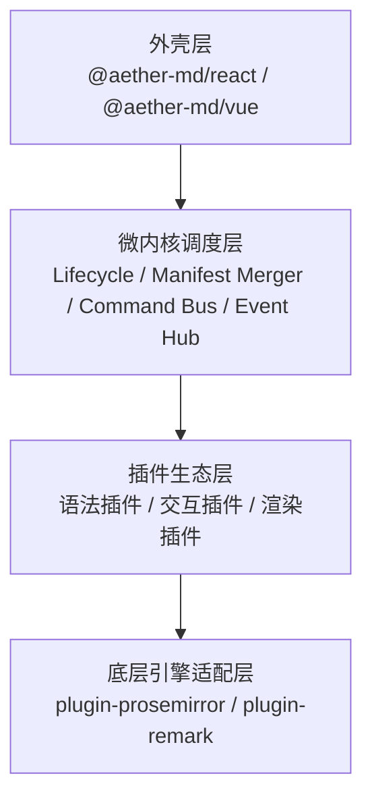

# 架构总览


## 架构总览



**单向依赖流：**

$$\text{UI Shell} \longrightarrow \text{AetherCore} \longrightarrow \text{Plugin Contract} \longrightarrow \text{Adapter}$$

**跨文档职责映射：**

| 架构概念                                                       | 详细规范                                                 |
| -------------------------------------------------------------- | -------------------------------------------------------- |
| Manifest 分层、Lifecycle、Command Pipeline、Service Capability | → Plugin SDK                                             |
| Core 宿主入口、AetherDoc 文档模型                              | → [Core API](core-api.md)、[文档模型](document-model.md) |
| Error Model、Thread、Observability、Security、Concurrency      | → 工程文档                                               |
| Adapter 边界、MVP 实施、测试策略                               | → [工程文档](../engineering/README.md)                   |
| 数据流拓扑、Adapter 防腐层                                     | → 本页「确定性数据流」「容器化适配器」                   |

---

## 确定性数据流

编辑器包含**正常事务流**与**错误恢复流**两条流水线（完整图示见 [确定性双向数据流](../engineering/data-flow.md)）。核心路径：

```
Command → Adapter Transaction → Doc Update → Render → Serialize → Event → Shell GateLock
```

错误分类与恢复策略见 [错误模型](../engineering/error-model.md)。

---

## 容器化适配器

```
BoldPlugin  →  AetherSchema (纯 JSON)  →  plugin-prosemirror  →  ProseMirror API
```

所有插件声明的 `AetherSchema` **MUST NOT** 携带 PM / Remark 原生类型。破坏性引擎升级时，**仅需重写对应 Adapter**，上层插件源码可保持不变。

---
