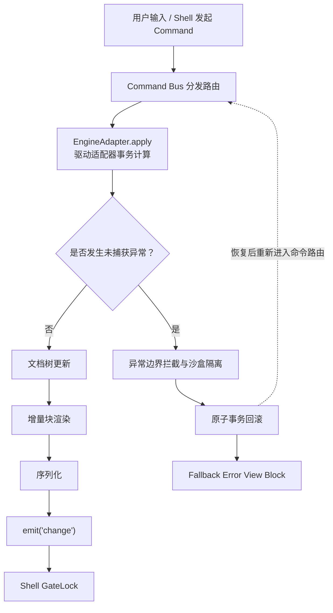

# 确定性双向数据流

> 状态：设计草案 + M3 Adapter 基座（最小 round-trip 子集）。完整 Command Bus 数据流仍属 v1.0 目标。本页作为对应主题的维护入口。

## 确定性双向数据流

```mermaid
flowchart TB
  input["用户输入 / Shell 发起 Command"]
  bus["Command Bus 分发路由"]
  adapter["EngineAdapter.apply<br/>驱动适配器事务计算"]
  decision{"是否发生未捕获异常？"}

  update["文档树更新"]
  render["增量块渲染"]
  serialize["序列化"]
  event["emit('change')"]
  gate["Shell GateLock"]

  boundary["异常边界拦截与沙盒隔离"]
  rollback["原子事务回滚"]
  fallback["Fallback Error View Block"]

  input --> bus --> adapter --> decision
  decision -- "否" --> update --> render --> serialize --> event --> gate
  decision -- "是" --> boundary --> rollback --> fallback
  rollback -. "恢复后重新进入命令路由" .-> bus
```

---
