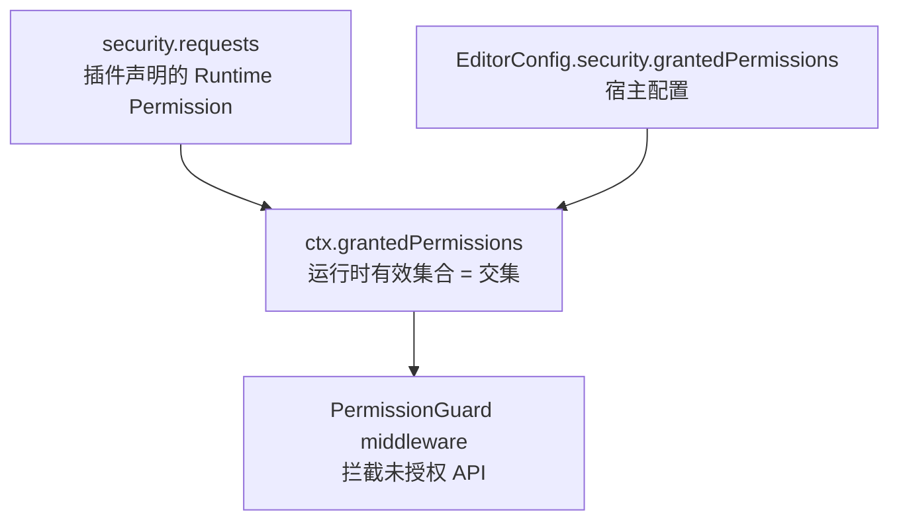

# Runtime Permission 安全模型

## Runtime Permission 安全模型

### Runtime Permission 授予流程



### 默认授予策略

| PermissionId     | 官方插件                         | 第三方插件                                         |
| ---------------- | -------------------------------- | -------------------------------------------------- |
| `perm:dom`       | 授予                             | 需 `security.requests` + 宿主 `grantedPermissions` |
| `perm:clipboard` | 授予（经 ClipboardService 代理） | 需申请                                             |
| `perm:async`     | 授予                             | 需申请                                             |
| `perm:timer`     | 授予                             | 需申请                                             |
| `perm:network`   | —                                | **MUST** 显式申请                                  |
| `perm:storage`   | —                                | **MUST** 显式申请                                  |
| `perm:worker`    | —                                | **MUST** 显式申请                                  |
| `perm:global`    | —                                | **默认拒绝**                                       |

### 沙盒隔离

- 第三方 Command handler **SHOULD** 在 `try/catch` 沙盒中执行
- 未捕获异常 **MUST** 转化为 `PluginError`，**MUST NOT** 导致编辑器崩溃
- 未授权 API 调用：开发环境 warn + 堆栈；生产环境静默拒绝
- 官方 `@aether-md/*` 插件 **MAY** 跳过沙盒，但 **SHOULD** 在 CI 覆盖同等测试

### EditorConfig 权限配置示例

```typescript
createEditor({
  plugins: [ThirdPartyPlugin()],
  security: {
    /** 宿主显式授予的权限白名单 */
    grantedPermissions: ["perm:dom", "perm:network"],
    /** 第三方插件默认拒绝列表（可选覆盖） */
    defaultDeny: ["perm:global", "perm:storage"],
  },
});
```

---
