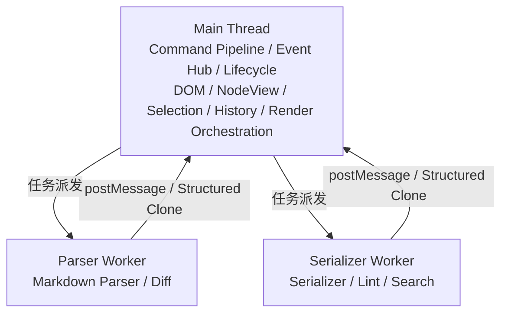

# 线程模型

## 线程模型

当前默认**主线程运行**全部逻辑。架构声明 Worker 化潜力（预留能力，非立即实现）：

| 模块                 | Worker 化       | 约束                    |
| -------------------- | --------------- | ----------------------- |
| Markdown Parser      | **RECOMMENDED** | 纯文本 / AetherDoc 进出 |
| Serializer           | **RECOMMENDED** | 脏节点增量              |
| Diff / Lint / Search | **MAY**         | 只读；结果经 Event 回传 |
| Command Pipeline     | **MUST NOT**    | 同步访问选区与 DOM      |
| NodeView Render      | **MUST NOT**    | 直接操作 DOM            |

**跨线程契约：**

- Worker **MUST** 通过 `Structured Clone` 传递 AetherDoc
- Worker **MUST NOT** 传递 DOM 或 PM 原生对象
- 结果 **SHOULD** 经 `ctx.events.emit('worker:result', payload)` 回传

---
