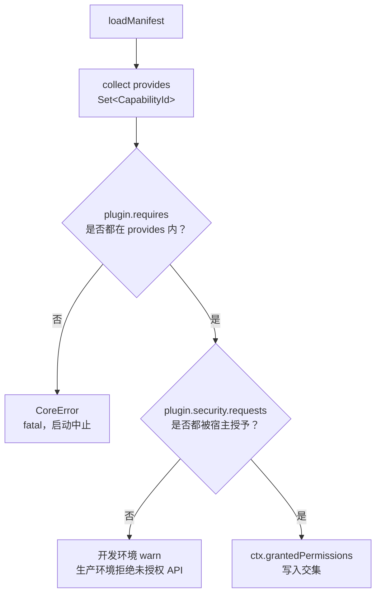

# Service Capability 与 Runtime Permission

> 状态：设计草案 + M1 Core Bootstrap（Service Capability 校验已实现）。本页作为对应主题的维护入口。

## Service Capability 与 Runtime Permission 双轨模型

### 设计原则

初始设计将框架服务依赖与运行时权限拆成两条独立轨道，避免把依赖声明和浏览器 API 许可混在同一概念平面：

| 术语                   | 用途                                       | 插件声明                                  | 宿主配置                                   | 类型           |
| ---------------------- | ------------------------------------------ | ----------------------------------------- | ------------------------------------------ | -------------- |
| **Service Capability** | 框架级功能依赖（选区、引擎、历史栈）       | `metadata.provides` / `metadata.requires` | —                                          | `CapabilityId` |
| **Runtime Permission** | 浏览器 / OS API 访问（网络、存储、Worker） | `security.requests`                       | `EditorConfig.security.grantedPermissions` | `PermissionId` |

```text
Service Capability              Runtime Permission
（框架服务依赖）                  （浏览器 API 许可）

metadata.requires:              security.requests:
  core:selection                  perm:dom
  core:engine                     perm:timer
metadata.provides:              EditorConfig.security.grantedPermissions:
  plugin:table                      perm:dom, perm:timer
                                → ctx.grantedPermissions（交集）
```

### CapabilityId（Service Capability 类型）

**MUST NOT** 使用裸 `string`，以避免 `table` / `Table` / `TABLE` 拼写灾难：

```typescript
/** 内核内置服务能力（由 Core / 官方 Adapter 注册） */
export type CoreCapabilityId =
  | "core:history"
  | "core:selection"
  | "core:clipboard"
  | "core:engine"
  | "core:parser"
  | "core:assets";

/** 插件服务能力（命名空间隔离） */
export type PluginCapabilityId = `plugin:${string}`;

/** 第三方扩展能力（带厂商前缀） */
export type VendorCapabilityId = `${string}:${string}`;

/** 联合类型 — 编译期校验 */
export type CapabilityId = CoreCapabilityId | PluginCapabilityId | VendorCapabilityId;

/** 运行时 branded type（可选，用于严格模式） */
declare const CapabilityIdBrand: unique symbol;
export type BrandedCapabilityId = CapabilityId & { [CapabilityIdBrand]: true };
```

**命名约定（RECOMMENDED）：**

| 前缀      | 示例             | 说明                    |
| --------- | ---------------- | ----------------------- |
| `core:`   | `core:selection` | 内核或官方 Adapter 提供 |
| `plugin:` | `plugin:bold`    | 官方语法插件提供        |
| `vendor:` | `acme:poll-card` | 第三方厂商扩展          |

### PermissionId（Runtime Permission 类型）

```typescript
/** Runtime Permission（宿主根据 security.requests 与 grantedPermissions 交集授予） */
export type PermissionId =
  | "perm:dom" // 创建/操作 DOM
  | "perm:clipboard" // 剪贴板读写
  | "perm:network" // fetch / XHR
  | "perm:storage" // localStorage / IndexedDB
  | "perm:worker" // Web Worker
  | "perm:timer" // setTimeout / setInterval
  | "perm:async" // Promise / async handler
  | "perm:global"; // window / globalThis
```

### 解析与校验流程



### 内置 Service Capability 注册表

```typescript
/** Core 启动时自动 provides 的服务能力 */
export const CORE_SERVICE_REGISTRY: readonly CoreCapabilityId[] = [
  "core:history",
  "core:selection",
  "core:clipboard",
  "core:engine", // 需 plugin-prosemirror Adapter
  "core:parser", // 需 plugin-remark Adapter
  "core:assets",
] as const;
```

### M1 Core Bootstrap capability subset

`@aether-md/core` 的 M1 Core Bootstrap 实现只自动提供以下能力：

```typescript
export const M1_CORE_CAPABILITIES = [
  "core:history",
  "core:selection",
  "core:clipboard",
  "core:assets",
] as const;
```

`core:engine` 和 `core:parser` 仍属于 `CoreCapabilityId`，但依赖官方 Adapter。M1 在 Adapter package 存在前不会 silent provide 这两个 capability；如果插件要求它们且没有 loaded plugin 提供，bootstrap 必须以 fatal `CoreError` 中止。

---
