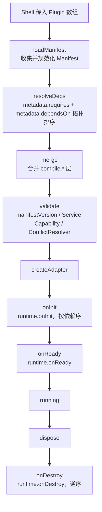

# 扩展生命周期

> 状态：设计草案。实现开始前，本页作为对应主题的维护入口。

## 扩展生命周期

**阶段约束：**

| 阶段 | 允许 | 应避免 |
| --- | --- | --- |
| `loadManifest` ~ `validate` | 纯数据操作 | 副作用、DOM |
| `onInit` | DOM 绑定、事件订阅 | 注册 Command |
| `onReady` | 读取初始状态 | 修改已合并 Schema |
| `running` | Command Bus | 直接调用 Adapter 内部 API |
| `onDestroy` | 资源清理 | 派发新 Command |

---
