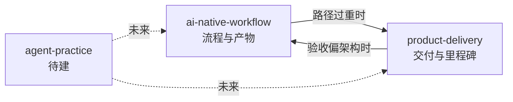

# 随笔

本目录记录 AetherMD 项目开发过程中的思考与复盘。与 [`docs/`](../docs/)（架构、SDK、工程策略）和 [`AI_NATIVE_ENGINEERING_WORKFLOW.md`](../AI_NATIVE_ENGINEERING_WORKFLOW.md)（工作流规范）分离：**规范写怎么做，随笔写为什么、踩过什么坑、接下来想改什么。**

文章按**主题**分目录，每个主题是一条可独立演进的小系列。新增主题时在此登记，不必全部塞进同一个文件夹。

## 主题索引

| 主题 | 目录 | 回答什么问题 |
| --- | --- | --- |
| **AI-native 工作流** | [`ai-native-workflow/`](./ai-native-workflow/) | 如何用 Docs / OpenSpec / Superpowers / Skill 约束 Agent；路径分级、task 粒度、产物归档 |
| **产品与交付** | [`product-delivery/`](./product-delivery/) | MVP 怎么定、纵向切片 vs 横向铺层、demo 作为 north star |
| *Agent 协作实践* | *(待建 `agent-practice/`)* | 上下文策略、prompt 边界、人机分工（尚无文章） |

## 主题之间的关系

[`product-delivery/01`](./product-delivery/01-mvp-intent-vs-architecture-proof.md) 与 [`ai-native-workflow/05`](./ai-native-workflow/05-workflow-artifact-debt.md) 是 M1–M6 复盘的一体两面，可交叉阅读。

## 续写约定

1. **新主题**：在 `essays/<theme>/` 建目录和 README，并更新本页主题索引。
2. **新文章**：`<theme>/NN-kebab-case-title.md`，编号仅在主题内递增。
3. **质量门槛**：有独立论点；可引用 OpenSpec change / 里程碑，但不堆砌变更日志；写清适用与不适用场景。

## 与仓库其他位置

| 位置 | 用途 |
| --- | --- |
| [`docs/engineering/demo-slice-delivery-program.md`](../docs/engineering/demo-slice-delivery-program.md) | **活跃执行计划**（PR0→PR A→PR B） |
| [`docs/`](../docs/) | 长期架构与 SDK 事实 |
| [`openspec/`](../openspec/) | 可执行规格与变更 delta |
| [`.superpowers/`](../.superpowers/) | 计划、task、验证、review 执行记录 |
| **本目录 `essays/`** | 反思、复盘、尚未写入规范的经验 |
