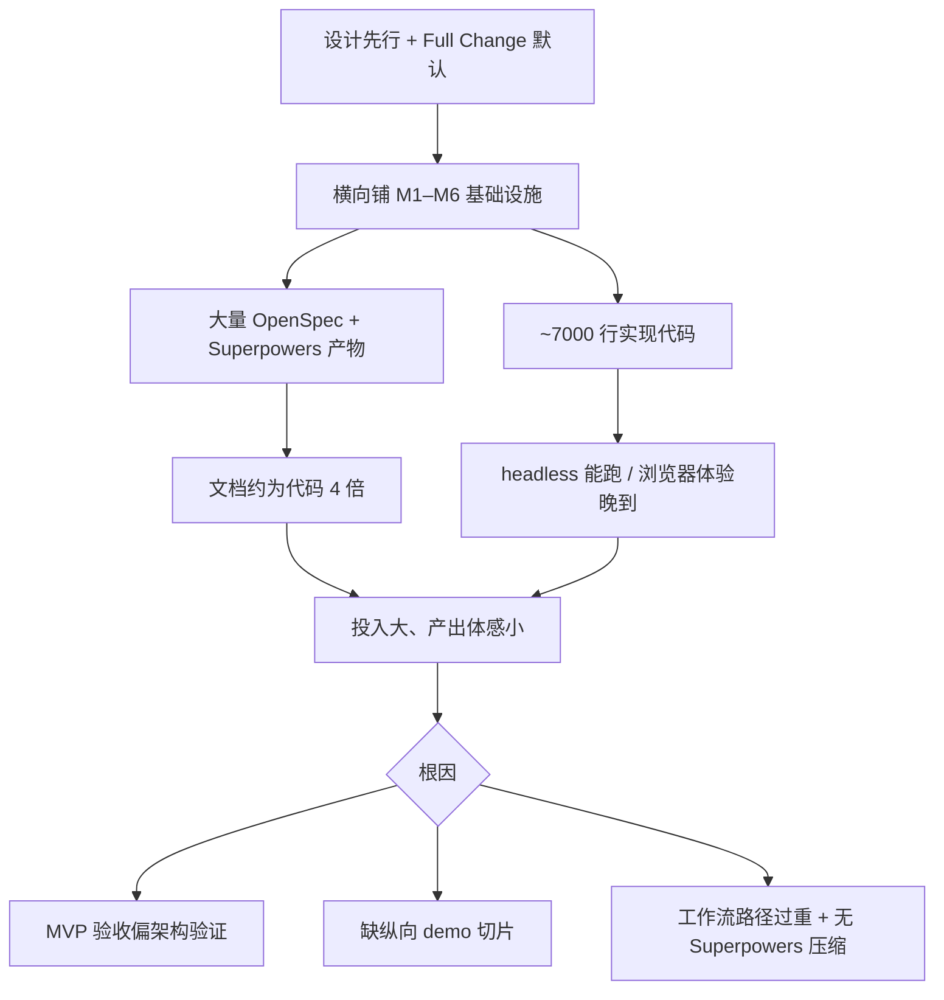

# 05 · 工作流产物债务与路径降档

> 状态：初稿 · 2026-07  
> 主题：[AI-native 工作流](./README.md)  
> 背景：M1–M6 闭合后，对 OpenSpec / Superpowers 体量的复盘  
> 相关主题：[产品与交付 · 01 · MVP 验收偏了](../product-delivery/01-mvp-intent-vs-architecture-proof.md)

## 现象：流程产物堆成了「第二座仓库」

M1–M6 期间，11 个 Full Change 走完整九步（proposal → plan → 7–11 个 task → loop → review → archive）。其中：

- **7 个** MVP 里程碑（Core、Command/Event、Adapter、GFM、Editor、React Shell、Validation …）
- **4 个** 工作流自身（path classification、task loop 并行、skill 单一源、…）

**实现编辑器** 与 **打磨工作流** 各走同一套最重路径，产物翻倍。

按 2026-07 当前仓库的粗略统计，口径为：只看工作区内 `.md`、排除 `node_modules`、代码只计 `packages/` 与 `examples/` 下的 `ts/tsx`。单看 workflow 产物时，粗算 `.superpowers/` 与 `openspec/changes/archive/`：

| 区域 | 行数量级 | 状态 |
| --- | --- | --- |
| `.superpowers/tasks/` | ~9,800 | 11 个 change，各 7–11 个 task |
| `.superpowers/plans/` | ~3,800 | 每 change 一份 plan |
| `.superpowers/reviews/` + `runs/` | ~4,500 | review + validation + final-report |
| `openspec/changes/archive/` | ~5,700 | 已全部归档 |
| `openspec/specs/` | ~2,200 | 当前契约真相（应保留） |

OpenSpec 有 archive 目录；Superpowers **长期缺少压缩/归档步骤**，执行记录一直堆在根目录。Agent 和人类打开 `.superpowers/` 时，signal-to-noise 比很低。

## 三个诊断问题

| 问题 | 答案 |
| --- | --- |
| 是工作流设计错了？ | **不完全是。** 四层模型与 task 边界仍然有效（见 [02](./02-layered-artifacts-and-boundaries.md)、[04](./04-task-as-minimum-execution-unit.md)）。 |
| 是 **使用方式** 错了？ | **主要是。** Full Change 被过度使用；Discover 将「MVP 首次实现」默认映射为 Full Change。 |
| 是任务粒度错了？ | **部分是。** 7–11 task/change 尚可；单 task 文件 100–160 行，metadata 对 **archive 后** 过厚。 |
| 该不该清理？ | **应该。** 真相已在 `openspec/specs/` 与 final-report；中间 task/plan 应可压缩。 |

## 四条路径：设计了，几乎没用上

[03 · 四条路径](./03-workflow-path-classification.md) 引入了 Maintenance → Quick Change → Spec Change → Full Change 的升级 ladder。

设计意图：按风险匹配产物厚度。

实际使用：M1–M6 **几乎每一步 MVP 都走 Full Change**；Spec Change（轻量 OpenSpec + 单 task）几乎未用；Quick Change 主要用于 workflow 小改。

原因不难理解：

1. 当时的 Discover 规则与 protected boundaries 把「MVP package 或 runtime 首次实现」放进了 **强制 Full Change** 条件。
2. Agent 倾向 over-classify 到「安全的一侧」——与 under-classify 到 Quick Change 相反，这里是 **系统性 over-classify 到 Full**。
3. 当 north star 是「把架构层铺全」时，每个 milestone **感觉** 都像 public contract 变更。

路径分级解决了「小改太重」的问题，却没有解决 **「demo 交付也太重」** 的问题。

## 因果链



工作流不是唯一根因，但与 MVP 定义 **互相加强**：越重的路径 → 越多 milestone 按层切 → 越难在 early slice 停下去摸 demo。MVP 侧分析见 [产品与交付 · 01](../product-delivery/01-mvp-intent-vs-architecture-proof.md)。

## 清理建议：分层留存

这部分更像我对下一轮 workflow 调整的建议，不是当前已经生效的仓库规范。

**长期保留（真相与摘要）：**

- `openspec/specs/` — 当前 capability contract
- `openspec/changes/archive/` — 变更历史（已归档）
- `.superpowers/runs/<change>/final-report.md` — 摘要：tasks completed、validation、deviations
- `.superpowers/runs/<change>/deviations.md` — 若有

**可压缩 / 移入 archive（执行期细节）：**

- `.superpowers/tasks/<change>/` — 完整 task 文件
- `.superpowers/plans/<change>.md`
- `.superpowers/reviews/<change>.md`
- 冗长的逐步 validation log（保留 final-report 里的矩阵即可）

建议目标结构：

```text
.superpowers/
  archive/
    2026-07-05-add-core-bootstrap/
      final-report.md
      deviations.md          # optional
  runs/                      # 仅 active change
  plans/                     # 仅 active change
  tasks/                     # 仅 active change
```

Git history 已保存完整 task diff；archive 后不必让 **活跃工作区** 继续承载 9,000 行 task 正文。

## 治本：工作流该怎么改

与 [产品与交付 · 01](../product-delivery/01-mvp-intent-vs-architecture-proof.md) 配套，四条可操作方向：

### 1. 重新定义 Full Change 门槛

| 应 Full Change | 应 Spec / Quick Change |
| --- | --- |
| public SDK / Manifest / Command·Event 变更 | 新增或完善 **example / demo**（不改 public export） |
| 新 capability 进 main spec | 文档澄清、测试补强（语义不变） |
| workflow semantics 变更 | 纵向 slice（浏览器能打字） |
| 多 task、多包、架构边界 | 单文件 GateLock demo 接线 |

如果后续要继续调整 Discover，我会优先区分 **「首次实现 runtime 行为」** 与 **「首次可运行 demo」**：前者更像契约实现，后者更像交付切片，不必天然落到同样厚的路径。

### 2. 里程碑按纵向切片

不再用 M1=Core、M2=Command 作为 **唯一** 进度叙事；并行维护 **Slice 看板**（Slice 1 能打字、Slice 2 GFM、…）。架构包仍可内部里程碑，但不替代用户可感知交付。

### 3. Superpowers retention 规则

一个自然的落点，是在 `aether-workflow-archive-change` 里增加显式 retention 步骤：

- archive OpenSpec change 后，将对应 `.superpowers/tasks/`、`.superpowers/plans/`、`.superpowers/reviews/` 移入 `.superpowers/archive/<date>-<change>/` 或删除（仅留 final-report）。
- final-report 的 **Tasks Completed 表** 作为 task 的归档摘要，不要求保留 100+ 行 task 原文。

### 4. 精简 task 的生命周期

- **执行期**：完整 template（Allowed Files、TDD、Validation）——对 Agent 仍有价值。
- **归档后**：只留 final-report 一行摘要；不在活跃目录长期堆放。

这与「task 是最小执行单元」不矛盾——**执行单元** 不等于 **永久文献**。

## 对工作流假设的修正（不是推翻）

[01 · 为什么需要 AI-native 工作流](./01-why-we-built-an-ai-native-workflow.md) 的核心判断仍然成立：Agent 需要边界与可追溯性。

M1–M6 教会的 **追加** 教训：

1. **可追溯性要有 retention policy**，否则追溯的是 noise。
2. **路径分级必须绑定 north star**；否则 Spec Change 永远是空档位。
3. **工作流自身变更** 不应与 **产品 milestone** 使用相同权重——改 task loop 可以是 Spec Change，不必与 add-react-shell 同厚度。

## 一句话

> **目标方向没错，暴露出来的问题也很具体：** workflow 需要的不再只是更多 traceability，而是 **traceability 的留存策略** 与 **更贴近交付的路径厚度**。否则它会持续擅长留下记录，却不擅长把活跃工作区保持在一个轻、清楚、可推进的状态。

---

系列目录：[AI-native 工作流](./README.md) · [随笔总索引](../README.md)  
上一篇：[04 · Task 是最小执行单元](./04-task-as-minimum-execution-unit.md)  
相关主题：[产品与交付 · 01 · MVP 验收偏了](../product-delivery/01-mvp-intent-vs-architecture-proof.md)
